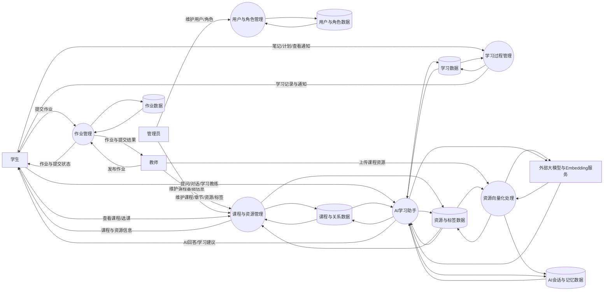

# 第一章 绪论

## 1.1 设计背景及意义

随着在线教育和智能学习工具的不断发展，传统的课程管理系统已经难以满足学习者对个性化辅导、课程资源快速检索、学习过程持续跟踪和智能问答支持的需求。尤其是在课程资源不断增加、学习任务日益复杂的背景下，学生不仅需要查看课程和完成作业，还希望系统能够结合学习记录、课程资料和个人进度，提供更加智能、更加贴近实际学习场景的服务。

当前项目以“智能课程学习平台”为目标，围绕课程、资源、作业、笔记、学习计划、通知和 AI 学习助手等核心场景展开设计。系统通过统一的数据模型管理课程学习全过程，并借助 AI 会话、资源向量化检索和学习教练机制，将传统教学管理功能与智能辅助能力结合起来。

本项目的设计意义主要体现在以下几个方面：

1. 有助于构建完整的课程学习闭环，实现从课程浏览、资源学习到作业提交、笔记记录和学习计划管理的一体化支持。
2. 有助于提升课程资源利用效率，通过标签、版本和资源分块机制增强资源组织与检索能力。
3. 有助于实现智能化学习辅助，通过 AI 对话、课程问答、学习教练和个性化记忆机制提升学习体验。
4. 有助于培养面向实际项目的数据库设计和系统开发能力，使数据库关系模型与应用代码实现保持一致。

## 1.2 内容与要求

本项目以当前目录结构中的 `backend`、`frontend_streamlit`、`scripts` 和 `uploads` 等模块为基础，要求完成一个面向课程学习场景的智能平台设计与实现。其主要内容与要求如下：

1. 建立完整、规范的数据库关系模型，支持用户、角色、课程、章节、资源、标签、作业、通知、AI 会话等业务对象的数据存储。
2. 实现课程与学习业务的基础功能，包括课程管理、章节管理、资源管理、选课与授课关系管理、作业管理、学习笔记与学习计划管理等。
3. 实现前后端分层架构，后端负责 API、业务逻辑和数据库访问，前端负责页面展示与交互。
4. 结合 AI 能力实现智能问答、统一助手、学习教练和资源向量化处理等扩展功能。
5. 保证系统具有较好的可维护性与扩展性，数据库设计应能够支持后续新增业务模块和智能功能。

## 1.3 本项目主要功能

结合当前项目源码，系统主要功能可概括为以下几个部分：

1. 用户与角色管理
   系统支持用户信息维护与角色管理，用于区分学生、教师、管理员等不同身份，并为后续课程、作业和通知等业务建立数据归属关系。

2. 课程与章节管理
   系统支持课程的新增、查询、修改和删除，并支持在课程下维护章节信息，形成清晰的课程内容结构。

3. 课程资源与标签管理
   系统支持课程资源上传、资源版本维护、标签定义与资源标签绑定，便于教师对学习资料进行整理和分类。

4. 授课与选课管理
   系统通过授课关系表和选课关系表维护教师与课程、学生与课程之间的联系，为课程成员管理提供基础。

5. 学习过程管理
   系统支持学生记录课程学习笔记、制定学习计划、查看通知，从而形成完整的学习过程数据。

6. 作业与提交管理
   系统支持教师发布作业，学生提交作业内容，并可记录作业提交状态、提交时间和提交结果。

7. AI 智能学习助手
   系统支持 AI 会话创建、消息记录、课程问答、统一智能助手和学习教练流程，可结合课程资料上下文为用户提供辅助回答。

8. 资源向量化与个性化记忆
   系统支持对课程资源进行分块与向量化处理，并通过 AI 记忆表记录学习教练过程中的阶段总结，为个性化分析和后续问答提供基础。

# 第二章 开发环境和开发技术

## 2.1 系统开发环境

### 2.1.1 硬件环境

根据当前项目的运行特征，系统开发和测试可采用如下硬件环境：

1. 处理器：Intel Core i5 / AMD Ryzen 5 及以上
2. 内存：8GB 及以上，推荐 16GB
3. 硬盘：至少 10GB 可用存储空间
4. 网络：可稳定访问 PostgreSQL 云数据库和外部大模型、Embedding 服务

该项目本地运行时需要同时启动后端服务和 Streamlit 前端，并可能调用外部数据库与 AI 接口，因此稳定的网络环境和足够的内存更有利于开发调试。

### 2.1.2 软件环境

结合当前项目配置，系统开发环境如下：

1. 操作系统：Windows 10/11、Linux 或 macOS 均可
2. 编程语言：Python 3.13 及以上
3. 包管理工具：uv
4. 后端运行环境：FastAPI + Uvicorn
5. 前端运行环境：Streamlit
6. 数据库：PostgreSQL（Neon 云数据库）
7. ORM 与数据库驱动：SQLAlchemy 2.x、asyncpg
8. 环境配置：`.env` 配置文件
9. 主要开发工具：VS Code、PyCharm 或其他支持 Python 的 IDE

## 2.2 系统开发技术

### 2.2.1 Python 技术

本项目采用 Python 作为统一开发语言。Python 语法简洁、生态丰富，适合快速构建 Web 服务、数据处理逻辑和 AI 应用。在本项目中，Python 同时承担后端接口开发、前端页面开发、数据库建模和 AI 服务编排等任务，有助于降低多技术栈切换带来的开发复杂度。

### 2.2.2 PostgreSQL 数据库

系统采用 PostgreSQL 作为核心数据库，并通过 Neon 云数据库提供在线存储能力。PostgreSQL 具有较强的事务支持、扩展能力和 JSON/向量相关能力，适合本项目既包含传统关系数据，又包含 AI 扩展数据的场景。项目中的用户、课程、作业等基础业务数据以及 AI 消息、AI 记忆等数据均统一存储在 PostgreSQL 中。

### 2.2.3 Streamlit 前端框架

项目的前端部分采用 Streamlit 实现。相较于传统的前后端分离 Web 框架，Streamlit 更适合快速构建数据驱动型和功能型界面，能够较高效地完成课程浏览、通知查看、笔记记录、学习计划填写和 AI 对话等页面开发工作。当前项目中的 `frontend_streamlit` 模块即负责系统页面渲染和用户交互。

### 2.2.4 FastAPI 后端框架

项目后端采用 FastAPI 构建 RESTful API。FastAPI 具有开发效率高、异步支持强、接口定义清晰、自动文档友好等优点，适合构建课程、作业、学习管理和 AI 服务相关接口。当前项目在 `backend/routers` 中划分了用户、课程、学习、作业和 AI 等多个接口模块，结构清晰，易于维护和扩展。

### 2.2.5 SQLAlchemy 异步 ORM

系统使用 SQLAlchemy 2.x 作为 ORM 框架，并结合 `asyncpg` 实现异步数据库访问。该方案既保留了关系数据库建模的规范性，又提高了接口并发处理能力。项目中的所有核心表结构均通过 SQLAlchemy 模型定义，并在系统启动时自动完成表创建。

### 2.2.6 LangChain 与大模型接口集成

在 AI 功能方面，项目使用 LangChain 组织大模型调用逻辑，并通过兼容 OpenAI 协议的接口访问外部大模型服务。系统在此基础上实现了普通聊天、课程问答、统一助手和学习教练等能力，使 AI 模块不仅能完成对话，还能结合课程上下文和学习进度提供辅助分析。

### 2.2.7 pgvector 与向量检索技术

为了支持课程资料检索增强问答和个性化记忆检索，项目引入了 pgvector 扩展。系统在数据库中保存资源分块结果和 AI 记忆向量，使课程内容能够被向量化处理，并在用户提问时检索相关上下文，再将其交给大模型生成回答。这种方式能够有效提升问答结果与课程内容的相关性。

### 2.2.8 文件上传与资源向量化处理

系统支持课程资源上传，并在资源上传后进一步执行内容切分和向量化处理。上传后的资源不仅可以作为普通教学资料保存，还可以被转换为适合检索的资源分块数据，为课程问答、统一助手和学习教练提供知识基础。这一技术环节是当前项目区别于普通课程管理系统的重要特征之一。

# 第三章 系统分析

## 3.1 可行性分析

### 3.1.1 技术可行性

本项目采用 Python 技术栈进行开发，后端使用 FastAPI，前端使用 Streamlit，数据库采用 PostgreSQL，并结合 SQLAlchemy 异步 ORM 实现数据访问。从当前项目目录结构和源码实现来看，系统的主要业务模块已经具备清晰的分层结构，包括用户管理、课程管理、学习管理、作业管理以及 AI 助手模块，因此在技术实现上具有较高可行性。

同时，项目已具备资源上传、资源分块、向量化处理、AI 会话管理和课程问答等功能基础，说明系统不仅可以完成传统教学业务处理，还能够进一步支持智能学习辅助场景。整体而言，当前采用的开发框架成熟度高、社区支持完善、扩展能力较强，能够满足本系统的开发与后续优化需求。

### 3.1.2 法律可行性

本项目主要面向课程学习和教学辅助场景，涉及的数据包括用户基本信息、课程信息、作业内容、学习记录和 AI 会话记录等。系统在设计和实现过程中应遵循国家关于个人信息保护、网络安全和数据安全的相关要求，对用户资料和学习数据进行合理存储与使用。

在资源管理和 AI 功能使用方面，系统应保证上传资料来源合法，不得非法传播受版权保护的教学内容；同时在调用外部大模型和向量接口时，应注意用户数据脱敏、最小必要原则以及接口调用合规性。因此，从法律层面看，只要在系统部署和使用过程中落实数据保护、权限控制和合法资源使用要求，本项目具有可行性。

## 3.2 需求分析

### 3.2.1 功能需求

系统的功能需求主要包括以下内容：

1. 用户与角色管理需求
   系统应支持用户信息的新增、查询、修改和删除，并支持角色定义与角色分配，用于区分学生、教师、管理员等身份。

2. 课程管理需求
   系统应支持课程基本信息维护，并能够对课程章节、课程资源、资源版本和资源标签进行统一管理。

3. 授课与选课需求
   系统应支持教师与课程之间的授课关系维护，以及学生与课程之间的选课关系维护。

4. 学习支持需求
   系统应支持学生记录学习笔记、制定学习计划、查看系统通知，从而形成完整的学习过程支撑。

5. 作业管理需求
   系统应支持教师发布作业，学生提交作业，并能够查看和维护作业提交状态。

6. AI 学习助手需求
   系统应支持 AI 会话管理、AI 消息记录、课程问答、统一助手对话和学习教练流程，为用户提供智能化辅助学习服务。

7. 资源检索增强需求
   系统应支持对课程资源进行分块与向量化处理，使 AI 能够在回答用户问题时结合课程上下文进行更准确的检索与生成。

### 3.2.2 用户需求

系统的主要用户包括学生、教师和管理员，不同用户的需求如下：

1. 学生用户需求
   学生希望能够方便地查看课程信息、记录学习笔记、制定学习计划、查看通知、完成作业，并通过 AI 助手获得课程问答和学习建议。

2. 教师用户需求
   教师希望能够创建和维护课程、章节与课程资源，发布作业，管理授课课程，并利用 AI 能力提升资源服务和学习辅导效果。

3. 管理员需求
   管理员希望能够维护角色和用户信息，管理课程基础数据，并对系统整体运行状态进行维护和监督。

### 3.2.3 性能需求

为了保证系统具有良好的使用体验，需要满足以下性能需求：

1. 系统应能够在正常教学使用场景下稳定运行，保证课程、作业、笔记、通知等核心数据的及时读写。
2. 后端接口应具备较好的响应效率，常规查询和写入操作应尽量在较短时间内完成。
3. 系统应支持一定规模的课程资源存储，并能在资源增多时保持可维护的检索能力。
4. AI 问答和学习教练功能应能够结合课程上下文快速返回结果，尽量减少用户等待时间。
5. 数据库应具备较好的扩展能力，能够支持后续增加更多用户、课程和 AI 相关数据。

### 3.2.4 数据流图

